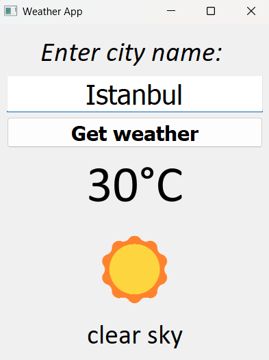

# 🌤️ PyQt5 Weather App

A simple desktop weather application built with Python and PyQt5.  
It allows users to enter a city name and view the current temperature, description, and a matching weather emoji.

I did it for educational purposes

## 🚀 Features

- Realtime weather data via OpenWeatherMap API 🌐
- Clean and centered UI built with PyQt5 🖥️
- Error handling for invalid input or connection issues ❌
- Emoji support based on weather conditions ⛅

## 🛠️ Technologies

- Python 3.x
- PyQt5
- Requests
- OpenWeatherMap API

## ⚙️ Installation

1. Clone the repository:

   ```bash
   git clone https://github.com/d1ngil/Weather_App.git
   cd Weather_App

## 📸 App view


